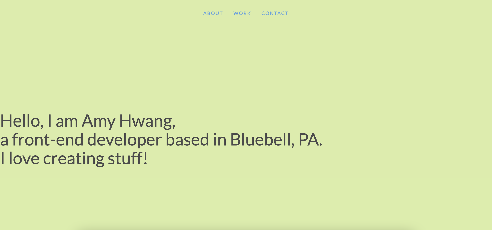

# Title

Updated Portfolio

# Description

A portfolio of work can showcase your skills and talents to employers looking to fill a part-time or full-time position. An effective portfolio highlights your strongest work as well as the thought processes behind it. In this assignment I’ll set myself up for future success by applying the core skills I've recently learned: flexbox, media queries, and CSS variables. 

# Demo

The following animation shows the web application's appearance and functionality:

# Links
https://github.com/wl0194/Amy-Hwang-portfolio
https://wl0194.github.io/Amy-Hwang-portfolio/

# License

MIT